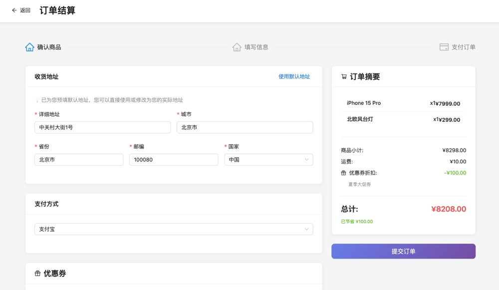

# 电商平台 (E-commerce Platform)

基于 monorepo 架构的线上商品交易平台，使用 SQLite 数据库。

## 🏗️ 项目结构

```
my-emall/
├── apps/                    # 应用程序
│   ├── frontend/           # Next.js 前端应用 (端口: 3000)
│   ├── backend/            # Express 后端 API (端口: 3001)
│   └── admin/              # React Admin 管理后台 (端口: 3002)
├── packages/               # 共享包
│   ├── shared/             # 共享类型和工具
│   └── coupons/            # 优惠券系统 (策略模式)
├── docs/                   # 文档
└── .cursorrules           # Cursor AI 规则
```

## 🛠️ 技术栈

- **前端**: React, Next.js 14, TypeScript, Ant Design
- **后端**: Node.js, Express, TypeScript
- **数据库**: SQLite + Prisma ORM
- **管理后台**: React Admin
- **包管理**: pnpm (monorepo)
- **代码质量**: ESLint, Prettier, Husky

## 🚀 快速开始

### 环境要求

- Node.js 18+
- pnpm 8+

### 安装依赖

```bash
pnpm install
```

### 初始化数据库

```bash
cd apps/backend
pnpm prisma generate
pnpm prisma db push
cp .env.example .env
pnpm db:seed
```

### 启动开发服务器

```bash
# 启动后端 API (http://localhost:3001)
pnpm dev:backend

# 启动前端应用 (http://localhost:3000)
pnpm dev:frontend

# 启动管理后台 (http://localhost:3002)
pnpm dev:admin
```

## 📦 可用脚本

```bash
# 开发
pnpm dev:frontend    # 启动前端
pnpm dev:backend     # 启动后端
pnpm dev:admin       # 启动管理后台

# 构建
pnpm build           # 构建所有项目

# 测试
pnpm test            # 运行所有测试

# 代码质量
pnpm lint            # 代码检查
pnpm format          # 代码格式化

# 数据库
cd apps/backend
pnpm db:generate     # 生成 Prisma 客户端
pnpm db:push         # 推送 schema 到数据库
pnpm db:studio       # 打开 Prisma Studio
```

## 🗄️ 数据库模型

主要数据模型包括：

- **User**: 用户管理
- **Product**: 商品信息
- **Category**: 商品分类
- **Order**: 订单管理
- **CartItem**: 购物车
- **Review**: 商品评价
- **Coupon**: 优惠券系统

## 🎯 功能特性

### 核心功能
- ✅ **用户管理**: 注册、登录、个人资料管理
- ✅ **商品管理**: 商品展示、分类、搜索、详情页
- ✅ **购物车**: 添加商品、数量调整、价格计算
- ✅ **订单系统**: 下单、支付、订单管理、状态跟踪
- ✅ **优惠券系统**: 多种优惠券类型、自动推荐、策略模式
- ✅ **管理后台**: 商品管理、订单管理、用户管理、数据统计

### 技术特性
- ✅ Monorepo 架构
- ✅ TypeScript 全栈
- ✅ SQLite 数据库
- ✅ Prisma ORM
- ✅ 优惠券策略模式
- ✅ 代码质量工具
- ✅ Git Hooks
- ✅ 共享类型和工具
- ✅ 现代化UI设计
- ✅ 响应式布局

## 🖼️ 界面截图

### 前端用户界面 (`screen/frontend/`)


主页：轮播图、分类导航、商品展示


商品列表：现代化卡片设计、悬浮效果


购物车：商品管理、价格计算


结算页面：地址信息、优惠券选择


个人中心：用户信息、订单历史


登录页面：品牌设计、测试账号

### 管理后台界面 (`screen/admin/`)


仪表板：数据统计、系统概览


商品管理：商品列表、编辑功能


订单管理：订单状态、用户信息


用户管理：用户列表、权限管理


优惠券：优惠券列表、编辑功能

> 💡 **提示**: 所有截图展示了完整的功能界面和现代化的UI设计，体现了专业的C端电商产品体验。

## 📚 开发指南

详细的开发指南请查看 `docs/`